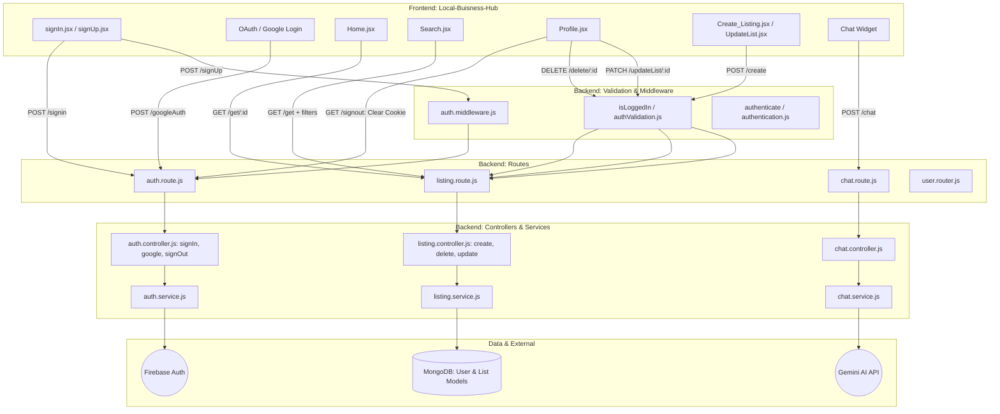

# 🏢 Local Business Hub (MERN + Gemini AI)

A professional, full-stack real estate platform featuring an AI-driven virtual assistant, secure Firebase/JWT authentication, and a modular architecture.

---

## 🏗️ Full-Stack System Architecture

This project follows a strict **Separation of Concerns** using a Controller-Service pattern. Every frontend action is mapped through a validated routing layer to a dedicated backend service.


---

## 🚀 Key Logic Flows

### 1️⃣ Identity & Security (Authentication)

- **Hybrid Authentication**
  - Supports traditional **email/password authentication**
  - Integrated **Google OAuth** via a dedicated Google controller

- **Middleware Pre-validation**
  - `signUp` routes are protected using `auth.middleware.js`
  - Ensures request validation before reaching service logic

- **Secure Session Handling**
  - JWT access tokens stored in **HTTP-only cookies**
  - `signOut` clears tokens securely from the server side

---

### 2️⃣ Protected Marketplace (Listings)

- **Access Control**
  - Critical operations like **Create, Update, Delete listings**
  - Fully protected using `isLoggedIn` middleware from `authValidation.js`

- **Service-Layer Isolation**
  - All listing logic abstracted into `listing.service.js`
  - Clean separation of concerns between controllers and business logic
  - CRUD operations handled on MongoDB `List` schema

- **Search & Discovery**
  - Advanced filtering and querying via `getAllListing_controller`
  - Enables efficient property discovery for users

---

### 3️⃣ AI Real Estate Assistant

- **Gemini AI Integration**
  - Uses **Google Generative AI SDK**
  - Modular implementation inside `chat.service.js`

- **Virtual Real Estate Expert**
  - Configured with system-level instructions
  - Provides:
    - Property explanations
    - Platform guidance
    - Context-aware real estate suggestions

---

## 📁 Project Structure

```text
MERN-LOCAL-BUSINESS-HUB/
├── Backend-Part/
│ ├── routes/ # API endpoint definitions
│ ├── controllers/ # Request handlers & responses
│ ├── service/ # Business logic & AI integrations
│ ├── validation/ # Auth & security middlewares
│ └── models/ # MongoDB schemas
│
├── Local-Buisness-Hub/
│ ├── src/
│ │ ├── components/ # Reusable UI components ( chat-widget, Contact, GoogleMapComponent, header, ListingItem, LoginModel, OAuth, PrivateRoute. )
│ │ ├── pages/ # React pages ( Home, About, Create_Listing, Saved, Search, signIn, signUp, UpdateList, Profile, Listings. )
│ │ ├── redux/ # Global state management 
| | |   ├── users
| | |   |    ├── slice.js
| | |   ├── store.js                                
│ │ └── utilsFrontend/ # Utility helper functions
│ │
│ ├── firebase.js # Firebase configuration
│ ├── .env # Frontend environment variables
│ ├── index.html # App entry HTML
│ ├── tailwind.config.js # Tailwind CSS configuration
│ ├── postcss.config.js # PostCSS configuration
│ ├── vite.config.js # Vite configuration
│ └── package.json
|
├── .env # Backend environment variables
├── package.json
├── .gitIgnore
|
├── screenshots/ # UI screenshots for README
│ ├── chatbot.png
│ └── listings.png
│
└── README.md
```
---

## 🚦 Quick Start

### ▶ Backend Initialization ( Note: The Backend-part folder inside the MERN-LOCAL-BUSINESS-HUB folder and this Backend-part folder just contain the code files, so it is recommended to install the npm inside the MERN-LOCAL-BUSINESS-HUB folder, as package.json of backend is inside the MERN-LOCAL-BUSINESS-HUB folder )

```bash
cd MERN-LOCAL-BUSINESS-HUB
npm install
# Port ex.--> Port = 1000
# Configure .env with:
# MONGO_URI
# GEMINI_API_KEY
# SECRET_KEY
npm run dev

cd Local-Buisness-Hub
npm install
# Configure .env with the following variables:
# Firebase & Google Maps configuration
# VITE_FIREBASE_API_KEY=
#
# Google Maps JavaScript API
# VITE_MAP_JAVASCRIPT_API_KEY=
npm run dev
```
### One Final Step for You
To make this look like a senior-level project, I recommend taking a clear screenshot of the **Chatbot UI** and your **Listings page**, saving them in a folder called `screenshots`, and adding them to the README under a "Gallery" section.


